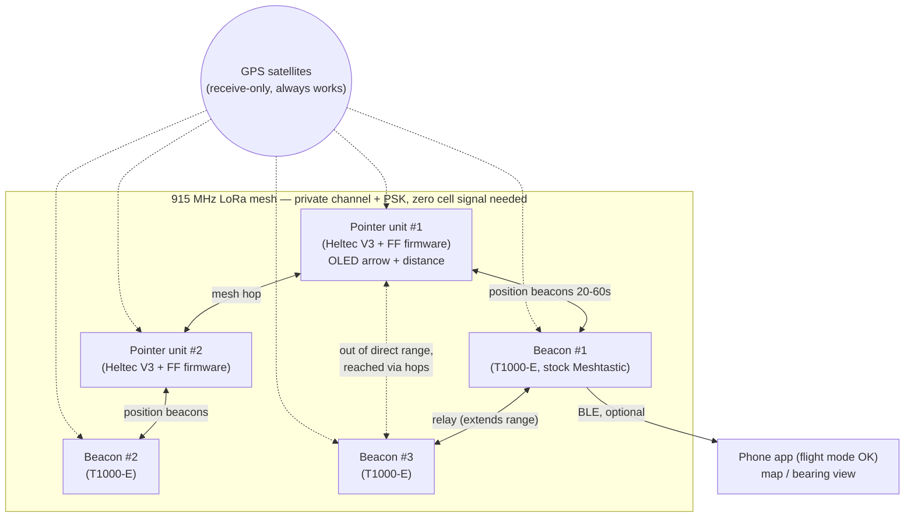
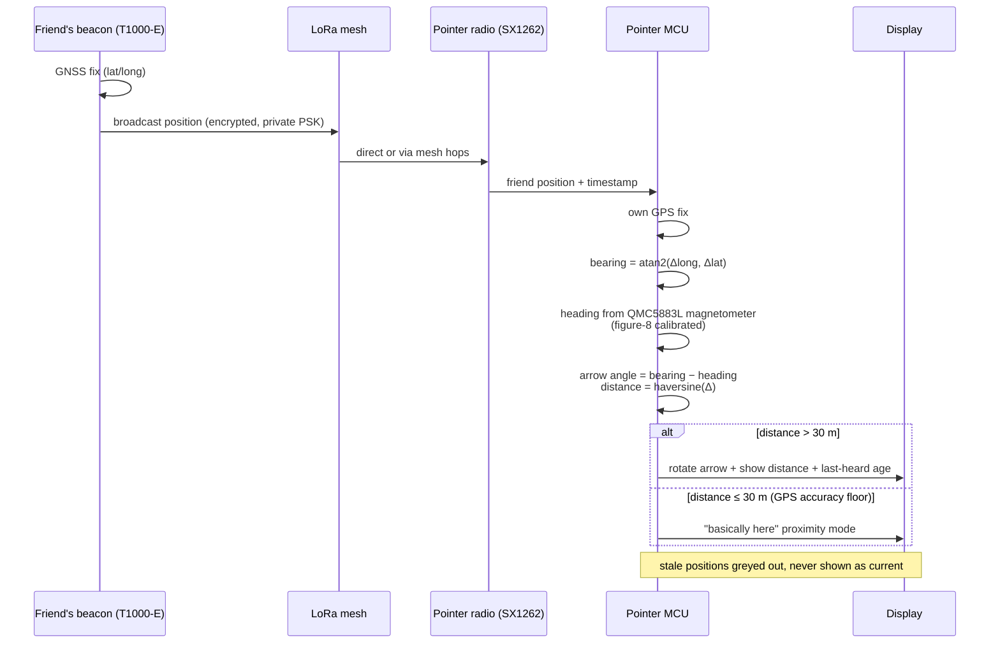
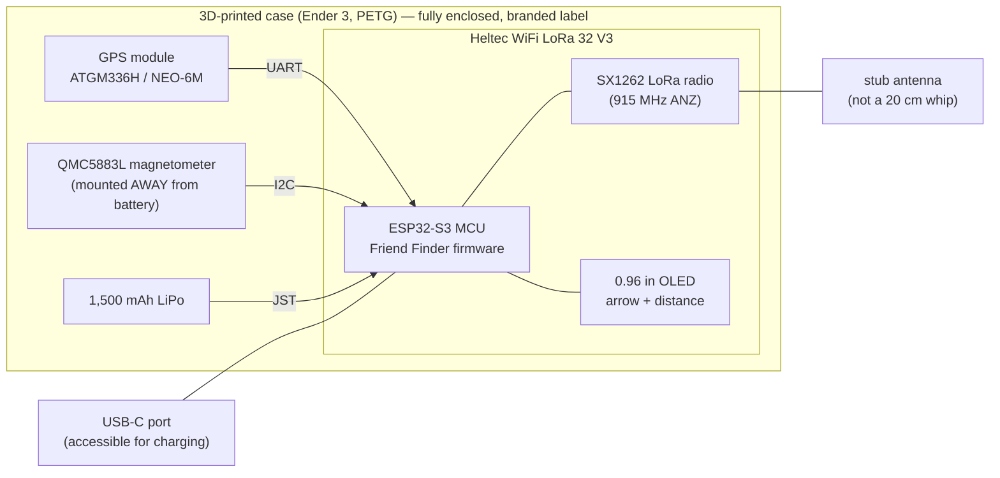
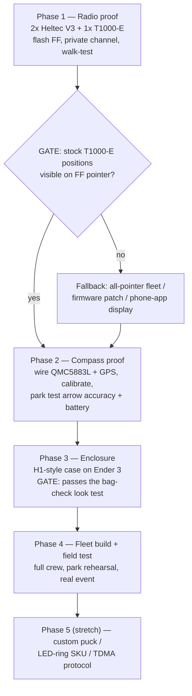

# Build plan

Target architecture: **Config 2 from the research** — a hybrid fleet on one private Meshtastic-compatible LoRa mesh (ANZ 915–928 MHz):

- **Pointer units** (2–3): handheld compass gadgets with a real arrow — Heltec V3 + magnetometer + GPS + LiPo in a 3D-printed case, running [Friend Finder Edition](https://github.com/LeapYeet/Meshtastic-Firmware-Friend-Finder-Edition) firmware.
- **Beacon units** (3–4): Seeed T1000-E card trackers on stock Meshtastic for the rest of the crew — zero build, consumer-finished, phone app as their (optional) display.

Upgrade path later: custom round-LCD puck (Config 3) once the mesh + bearing logic is proven; LED-ring beacon SKU as a cheaper DIY alternative to the T1000-E.

## How it works

### System overview

### Position → arrow pipeline (on a pointer unit)

1. **Position sensing**: every unit has GNSS — works with zero cell signal (GPS is receive-only).
2. **Position sharing**: units broadcast lat/long over LoRa on a private channel (own PSK, non-default frequency slot in case the festival has a public mesh). Mesh-hops via other crew members extend range.
3. **Bearing**: pointer unit computes bearing = atan2(Δlong, Δlat) from its GPS to the friend's last position, subtracts its own magnetometer heading (QMC5883L, figure-8 calibrated), rotates the arrow. Under ~30 m it switches to a "you're basically there" proximity mode (GPS accuracy floor).
4. **Distance**: haversine from GPS delta, shown next to the arrow.
5. **Staleness**: last-heard age shown per friend; stale positions greyed out, never silently trusted.

## Bill of materials (6-person crew, AUD approx.)

### Pointer unit ×3 (~$65 each)

| Part | Cost | Notes |
|---|---|---|
| Heltec WiFi LoRa 32 V3 (915 MHz) | ~$35 | validated Friend Finder board |
| GY-271 QMC5883L magnetometer | ~$4 | mount away from battery/speaker |
| ATGM336H or NEO-6M GPS module | ~$12 | |
| 1,500 mAh LiPo | ~$12 | ~1 day; power bank top-up at camp |
| 3D-printed case (muzi.works H1-style) | ~$2 | in-house Ender 3, PETG |

### Beacon unit ×3 (~$62–85 each)

| Part | Cost | Notes |
|---|---|---|
| Seeed T1000-E (AU915) | $62 direct / $85 local | pre-flashed Meshtastic, IP65, card-sized |

**Fleet total: ~AUD $400–450.**

## Build diagrams

### Pointer unit — hardware assembly

Beacon units need no assembly — the T1000-E is a finished product; just flash region ANZ + private channel.

### Build phases + gates

### Phase 1 — Radio proof (order → 1 weekend)
- Order 2 × Heltec V3 + modules + 1 × T1000-E (validate interop early).
- Flash Friend Finder via web flasher; set region ANZ, private channel + PSK.
- Two units exchanging positions on a desk, then a suburb walk-test: range, update latency, staleness behaviour.
- **Gate: stock-firmware T1000-E positions visible from a Friend Finder pointer.** If not, decide: all-pointer fleet vs firmware patch vs phone-app display for beacons.

### Phase 2 — Compass proof
- Wire QMC5883L + GPS to one pointer; figure-8 + flat-spin calibrate.
- Park test: two people, arrow accuracy while walking, close-range (<30 m) behaviour, magnetometer interference (phone in same pocket).
- Battery drain measurement at 20 s vs 60 s beacon interval.

### Phase 3 — Enclosure (mech eng + Ender 3)
- Print/adapt H1-style case; route GPS + magnetometer inside the shell, stub antenna, no visible wires.
- The "doesn't look like a bomb" gate: fully enclosed, branded label + QR code, reads as a commercial GPS gadget.
- PETG for heat; antenna port snug; USB-C accessible for charging.

### Phase 4 — Fleet build + field test
- Build remaining pointer units, buy remaining T1000-Es, bond/configure everything on the private channel.
- Full-crew park/park-run rehearsal, then a real event.
- Log: real crowd range, mesh-hop behaviour, battery over a full day, arrow usability in the dark.

### Phase 5 (stretch) — custom puck / LED-ring SKU
- Round GC9A01 LCD puck (crib LodeStone + Micro Compass) and/or LED-ring beacon (Totem-style UX, no screen).
- Crib spoke's PPS-synced TDMA + 13-byte payloads if stock Meshtastic intervals feel too stale.
- Touch-to-bond pairing UX instead of channel config.

## Design principles

- **LoRa or nothing** — 2.4 GHz dies in crowds (Totem's own users confirm: falls over when the crew spreads out).
- **Ephemeral by design** — live positions only, private PSK, no cloud, no accounts, no trails.
- **Degrade loudly** — stale data is shown as stale, never presented as current.
- **Consumer-finished or it doesn't ship** — every unit passes a bag check.

## Current State

- Phase: research complete (2 reports in docs/), plan drafted
- Next: order Phase 1 hardware (2× Heltec V3 + modules + 1× T1000-E)
- Blocked: nothing
