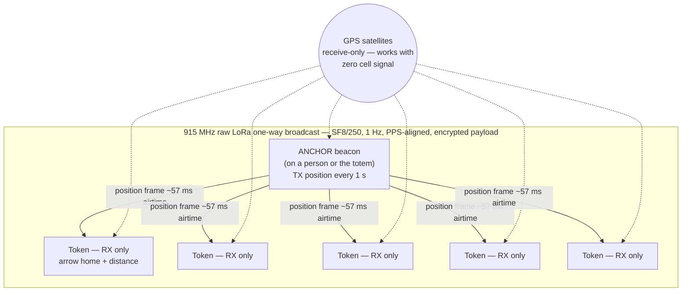
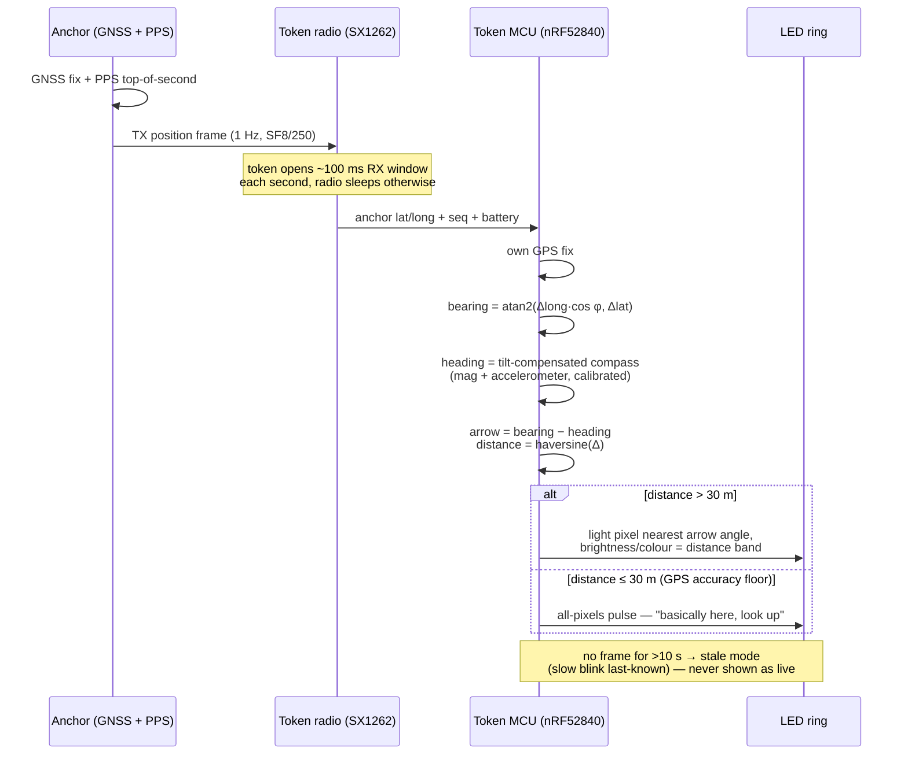
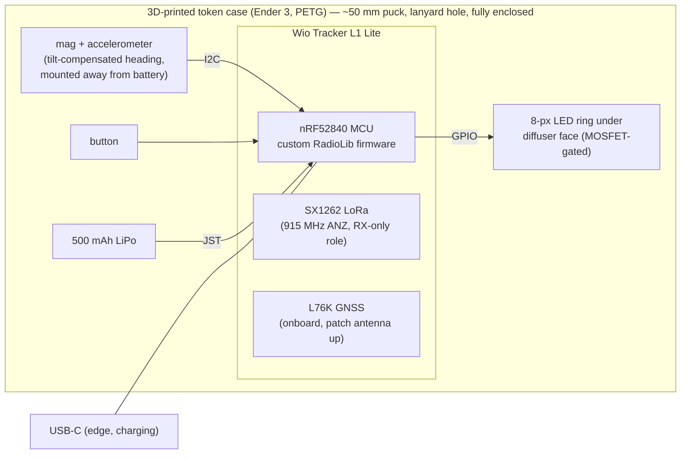
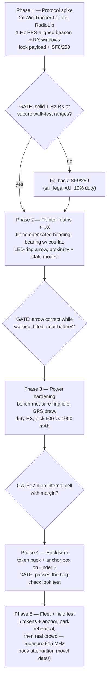

# Build plan

**Locked architecture (2026-09-02): single-beacon homing.** One **anchor** beacon — carried by one person or tied to the crew totem — broadcasts its GPS position over raw LoRa every second. Everyone else carries a small **RX-only pointer token**: GPS + tilt-compensated compass + an LED-ring arrow that always points at the anchor. Lost → follow arrow → crew converges.

Accepted trade-off: you find the *beacon*, not individuals. That's the product — "get back to the crew".

**Firmware base: custom raw-LoRa protocol on [RadioLib](https://github.com/jgromes/RadioLib) — NOT Meshtastic.** Stock Meshtastic can't beacon faster than 30 s; mesh/routing/ACKs are dead weight for one-TX/N-silent-RX. One firmware, two roles (`BEACON` / `TOKEN`). Full rationale + radio params: [docs/research-single-beacon.md](docs/research-single-beacon.md).

## How it works

### System overview

No mesh, no pairing, no phone. Tokens never transmit — unlimited listeners, zero congestion, and the anchor is the only thing burning TX power.

### Position → arrow pipeline (on a token)

1. **Position sensing**: anchor and tokens each have GNSS — works with zero cell signal (GPS is receive-only; degraded under solid roofs/stages).
2. **Position sharing**: one-way — the anchor broadcasts, tokens listen. Private encrypted payload, channel offset from the Meshtastic AU default so a festival full of trackers doesn't collide with us.
3. **Bearing**: `atan2(Δlong·cos φ, Δlat)` (the `cos φ` latitude scaling matters — ~6° systematic error at Sydney without it), minus tilt-compensated heading from mag + accelerometer. Bare magnetometer heading is wrong unless held level — tilt compensation is required, not optional.
4. **Distance**: haversine (overkill under 1 km but cheap).
5. **Staleness**: last-heard age tracked; stale positions shown as stale, never as live.

## Bill of materials (1 anchor + 5 tokens, AUD approx.)

### Token ×5 (~$80 each, budget path ~$60)

| Part | Cost | Notes |
|---|---|---|
| Seeed Wio Tracker L1 Lite | $57.30 | nRF52840 + SX1262 + L76K GPS on one board ([Core Electronics](https://core-electronics.com.au/seeed-wio-tracker-l1-lite-for-meshtastic.html), local stock) |
| Mag + accelerometer module | ~$6 | tilt-compensated heading; mount away from battery |
| 8-px SK6805 LED ring | ~$4 | MOSFET-gated, dim; the arrow |
| 500 mAh LiPo | ~$8 | 7 h comfortable on nRF52 (research §1) — no powerbank |
| Button + misc | ~$3 | wake/brightness |
| 3D-printed case | ~$2 | in-house Ender 3, PETG |

Budget alt: XIAO nRF52840 + Wio-SX1262 module + L76K ≈ $35 in boards → ~$60/token, more soldering.

### Anchor ×1 (~$75)

| Part | Cost | Notes |
|---|---|---|
| Seeed Wio Tracker L1 Lite | $57.30 | same board, `BEACON` role |
| 1,000–2,000 mAh LiPo | ~$12 | 7 h needs ~350–450 mAh — huge margin, no powerbank |
| Case + stub antenna | ~$5 | belt-clip + totem zip-tie channels |

**Fleet total (1 + 5): ~AUD $475** (or ~$375 via the XIAO path).

## Build diagrams

### Token — hardware assembly

Anchor = same board in a bigger box (belt-clip/zip-tie mount, larger LiPo, stub antenna, recessed power switch). GPS patch antenna faces the sky in both — tokens hang face-up on a lanyard.

### Build phases + gates

### Phase detail

1. **Protocol spike** — order 2× Wio Tracker L1 Lite (+ optionally 1 Heltec Wireless Tracker as a debug unit with a screen). Raw RadioLib beacon + scheduled RX windows, PPS-aligned. Lock the payload struct (~16–24 B). Cribs: [spoke](https://github.com/FeruzTopalov/spoke)'s PPS epochs, [natnafu/beacon](https://github.com/natnafu/beacon)'s payload + bearing→ring logic.
2. **Pointer maths + UX** — mag+accel tilt-compensated heading with figure-8 + LED-feedback calibration; bearing with `cos φ`; ring arrow; proximity (<30 m) and stale (>10 s) modes.
3. **Power hardening** — bench the open flags (ring quiescent draw, GPS real current, duty-RX average); battery size from measurements, not datasheets.
4. **Enclosure** — token puck (~50 mm, lanyard hole, diffuser face) + anchor box. Bag-check gate: fully enclosed, brand label, stub antenna, zero visible wires.
5. **Fleet + field** — build 5 tokens, park rehearsal, then a real event. Log range/battery/arrow accuracy to `docs/field-tests/`. Measured 915 MHz crowd body-attenuation doesn't exist publicly — capture and publish it.

## Design principles (canonical — CLAUDE.md refers here)

1. **LoRa or nothing** — 2.4 GHz dies in crowds (bodies attenuate it hard; Totem's users confirm the failure mode).
2. **Ephemeral by design** — live positions only, encrypted payload, no cloud, no accounts, no trails.
3. **Degrade loudly** — stale data is shown as stale, never presented as current.
4. **Consumer-finished or it doesn't ship** — every unit passes a bag check.

## Current State

- Phase: architecture locked (single-beacon homing); research ×3 + adversarial review done; docs rewritten
- Next: order Phase 1 hardware — 2× Wio Tracker L1 Lite (Core Electronics)
- Blocked: nothing
